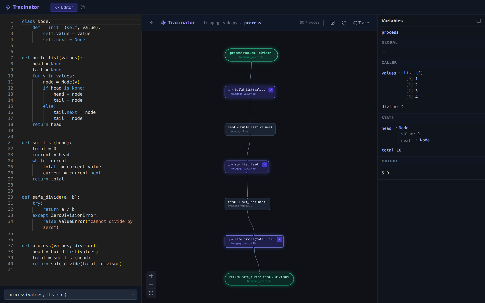

<div align="center">

# Tracinator

**See exactly how your Python code runs.**

Interactive control-flow graphs and real execution traces for Python functions.

[](pyproject.toml)
[](LICENSE)
[](#project-status)

[Online demo](https://tracinator.com) · [Documentation](https://tracinator.com/docs) · [Quick start](#quick-start) · [Contributing](#contributing)

<br>



</div>

---

## Overview

Debuggers show you one line at a time. Tracinator shows you the whole shape of a function first, then lets you run it and watch real values flow through that shape.

Point it at a function and it draws every branch, loop, call, and exception path as a flowchart, following calls across the files and folders of your project. Then give it real arguments and it runs the function and highlights the path it took, with the actual value of every variable at every step.

## Features

- **Control-flow graphs from source.** Built from Python's AST: `if`/`elif`/`else`, `for`, `while`, `try`/`except`/`finally`, `with`, `return`, `break`, `continue`, and `raise`. The same source always produces the same graph.
- **Cross-file call navigation.** Calls are resolved through your project's imports, and you can drill into any call to see that function's own flowchart. Depth is configurable.
- **Real execution traces.** Supply argument values, run the function, and see the exact path it took. Values come from actually executing the code, not from simulating it.
- **Variable inspection at any point.** Click a node to see the Global, Caller, State, and Output values at that moment. Objects expand into their fields, and a badge marks objects shared under more than one name.
- **Loops and recursion.** Repeated passes through a node are kept separate, so you can step through each iteration or recursive call instead of only seeing the last one.
- **Classes and methods.** Instance methods, class methods, static methods, inheritance (resolved with C3 method resolution order), and same-named methods on different classes, addressed as `Class.method`.
- **Runs on your machine.** The CLI and local web UI analyze and run your code locally. Nothing is uploaded.
- **Export.** Save a graph as a PNG from the web UI, or as text from the CLI.

## Ways to use it

| | Terminal (CLI) | Local web UI | Online demo | Desktop app |
|---|---|---|---|---|
| Interactive graph and tracing | – | ✓ | ✓ | ✓ |
| Browse your own multi-file project | – | ✓ | – | ✓ |
| Runs on your machine | ✓ | ✓ | – | ✓ |
| Install required | ✓ | ✓ | – | ✓ |
| Availability | Available | Available | [tracinator.com](https://tracinator.com) | In development |

The online demo works on pasted snippets only (up to 50 KB, following calls up to 6 levels deep) and runs them in a sandbox. For real projects, use the local web UI, the CLI, or, once released, the desktop app.

## Quick start

### Requirements

- Python 3.11 or newer
- Node.js 18 or newer, only to build the web UI when installing from source

### Install from source

From a checkout of this repository:

```bash
python -m venv .venv
source .venv/bin/activate          # Windows: .venv\Scripts\activate
pip install -e .

# One-time build of the web UI that `tracinator ui` serves.
# Not needed if you only use terminal output.
cd tracinator/ui && npm ci && npm run build && cd ../..
```

### Run it

```bash
# Open the web UI and browse a project's files and functions
tracinator ui --root path/to/your/project

# Jump straight to one function in the web UI
tracinator debug path/to/file.py my_function

# Print a flowchart in the terminal instead
tracinator debug path/to/file.py my_function --terminal
```

The web UI starts a local server on `http://localhost:7331` (bound to `127.0.0.1` only) and opens it in your browser.

## Usage

### `tracinator debug`

Renders the control-flow graph of one function.

```
tracinator debug <file> <function> [options]
```

| Option | Description |
|---|---|
| `<file>` | Path to the Python file. |
| `<function>` | Function name. For a method, use `Class.method` (or `Outer.Inner.method`). |
| `--root DIR` | Project root used to resolve imports (default: current directory). |
| `--depth N` | How many levels of calls to expand (default: 3). |
| `--no-calls` | Do not expand called functions. |
| `--terminal` | Print the flowchart in the terminal instead of opening the web UI. |
| `--wide` | Use the full terminal width. |
| `--export FILE` | Write the flowchart to a text file. |
| `--ui` | Open the web UI (this is the default unless `--terminal` or `--export` is given). |
| `--port N` | Port for the web UI server (default: 7331). |

### `tracinator ui`

Opens the web UI with a file browser for the project.

```
tracinator ui [--root DIR] [--port N]
```

### Example

```console
$ tracinator debug testing/01_basic_flow/functions.py process_payment --terminal --no-calls
```

```text
╭─────────────  ▶ ENTRY  ──────────────╮
│ process_payment(amount, user_id)     │
│ testing/01_basic_flow/functions.py:1 │
╰──────────────────────────────────────╯
     │
     ▼
┌────────────  STATEMENT  ─────────────┐
│ user = get_user(user_id)             │
│ balance = user['balance']            │
│ testing/01_basic_flow/functions.py:2 │
└──────────────────────────────────────┘
     │
     ▼
┏━━━━━━━━━━━━━━━  ◇ IF  ━━━━━━━━━━━━━━━┓
┃ if balance >= amount                 ┃
┃ testing/01_basic_flow/functions.py:5 ┃
┗━━━━━━━━━━━━━━━━━━━━━━━━━━━━━━━━━━━━━━┛
     │
  ✔ True                                      ✘ False
     │                                           │
     ▼                                           ▼
┌──────────────  ⊡ TRY  ───────────────┐    ┌─────────────  STATEMENT  ─────────────┐
│ try                                  │    │ notify_insufficient(user_id)          │
│ testing/01_basic_flow/functions.py:6 │    │ testing/01_basic_flow/functions.py:13 │
└──────────────────────────────────────┘    └───────────────────────────────────────┘
                                   (output trimmed)
```

### Tracing in the web UI

1. Pick a function from the dropdown, or open a file from the **Local File** tab.
2. Read the flowchart. Click a node to inspect it; double-click a call node to open that function's own graph.
3. Click **Trace**, enter real Python values for the arguments, and run.
4. The path that executed settles into solid lines, and the variable panel shows the real values at the node you selected.

Argument fields take Python source, not plain text: type `'hello'` (with quotes) for a string and `[1, 2, 3]` for a list. The [documentation](https://tracinator.com/docs) covers every node type, shortcut, and panel.

## How it works

```
   your .py files
        │
        ▼
  ┌────────────┐    ┌──────────────────┐    ┌────────────┐
  │  AST parse │ →  │ import + call +  │ →  │ control-   │ →  flowchart
  │            │    │ class resolution │    │ flow graph │    (terminal / web)
  └────────────┘    └──────────────────┘    └────────────┘

   on "Trace"
        │
        ▼
  run the function in a subprocess with sys.settrace
        │
        ▼
  event log (call / line / return, with real values) → highlighted path + variable panel
```

- **Analysis** (`tracinator/analyzer/`) parses source into an AST, resolves imports and calls within the project root, builds a class registry so methods have stable qualified names, and produces one control-flow graph per function.
- **Tracing** (`tracinator/tracer/`) runs the target in a separate subprocess under `sys.settrace` and records an event for every call, line, and return along with the actual values involved. The frontend indexes that log to answer questions like "what did this variable hold at this node, on the third pass through the loop?"
- **Serving** (`tracinator/server/`) exposes both through a small FastAPI app that the web UI, and the desktop shell, talk to.

## Scope and limitations

- Python source files (`.py`) only.
- Calls into third-party libraries (`requests`, `numpy`, ...) appear as a single leaf node; their internals are not expanded.
- Dynamic dispatch (`getattr`, dynamic imports) can't be resolved statically. Instance tracking for method calls is flow-insensitive: the last simple assignment wins.
- A trace runs for at most 5 seconds; longer runs are cut off with an error.
- Traced code runs with your project's own interpreter, found as `.venv` or `venv` under the project root, otherwise `python3` / `python` on `PATH`. It can be overridden through the local API (`POST /api/python-executable`).

## Security

- **Tracing executes your code.** Side effects such as file writes and network calls really happen. Only trace code you trust, just as you would only run it.
- The local server listens on `127.0.0.1` only.
- The online demo runs pasted code in a sandboxed environment with size, depth, and time limits, and never stores it. Its filtering is a convenience, not a security boundary; isolation comes from the infrastructure. Past vulnerabilities and their fixes are written up in [`RCA-docs/`](RCA-docs/README.md).

## Project structure

```
tracinator/
  analyzer/      AST parsing; import, call, and class resolution; graph construction
  tracer/        subprocess tracer built on sys.settrace
  renderer/      terminal flowchart renderer
  server/        FastAPI apps: full local backend (app.py) and sandboxed demo (demo_app.py)
  ui/            React + TypeScript frontend (React Flow, Monaco editor, Tailwind)
  cli.py         the `tracinator` command
src-tauri/       Tauri desktop shell (Rust)
infra/           Terraform and scripts for desktop-release hosting (releases.tracinator.com)
tests/           Python test suite (pytest)
testing/         sample projects used as fixtures
RCA-docs/        root-cause analyses of significant defects and security issues
```

## Development

### Set up

```bash
python -m venv .venv && source .venv/bin/activate
pip install -e ".[dev]"
cd tracinator/ui && npm ci
```

### Test

```bash
pytest                              # backend, from the repository root
cd tracinator/ui && npm test        # frontend
```

### Run locally with hot reload

```bash
infra/scripts/dev_app.sh            # real backend + Vite dev server
```

The sandboxed demo backend and demo-mode frontend (`dev_demo.sh`) live in
the separate [tracinator-site](https://github.com/MELVIN-SAM-V/tracinator-site)
repo, which vendors this repo's frontend and Python source to build them.

### Build the frontend

```bash
cd tracinator/ui && npm run build   # output in tracinator/ui/dist, served by `tracinator ui`
```

### Desktop app

The desktop app is a [Tauri](https://tauri.app) v2 shell (Rust 1.77.2 or newer) that bundles a private Python runtime and starts the local backend. It targets Windows and Linux and has not been released yet. The build steps are `infra/scripts/build_desktop_runtime.sh` (bundles the Python runtime) followed by `infra/scripts/publish_release.sh` (builds, signs, and publishes the installer).

### Desktop release hosting

`infra/` here only covers `releases.tracinator.com`, the Tauri updater's
manifest/installer host (Terraform, requires an AWS account; not yet
deployed — see [`infra/README.md`](infra/README.md)). The public demo site
(`tracinator.com`) and its Terraform live in the separate
[tracinator-site](https://github.com/MELVIN-SAM-V/tracinator-site) repo,
which vendors this repo's UI and Python source to build the combined
marketing+demo bundle and the demo's Lambda backend.

## Project status

Tracinator is in early development (version 0.1.0). It is usable, but the JSON API, the CLI options, and the desktop app are still evolving and may change between releases.

## Contributing

Contributions are welcome: bug reports, feature ideas, documentation fixes, and pull requests.

- **Reporting a bug:** include the smallest Python snippet that reproduces it, the command or UI action you used, and what you expected to see.
- **Proposing a change:** for anything larger than a small fix, open an issue first so the approach can be agreed before you invest time.
- **Opening a pull request:** keep it focused, add or update tests, and make sure `pytest`, `npm test`, and `npm run build` pass. A fix for a significant defect or security issue should come with a short write-up in [`RCA-docs/`](RCA-docs/README.md).

## License

Released under the [MIT License](LICENSE).
